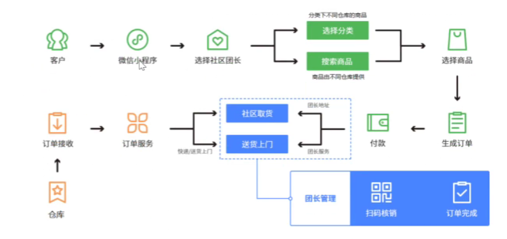
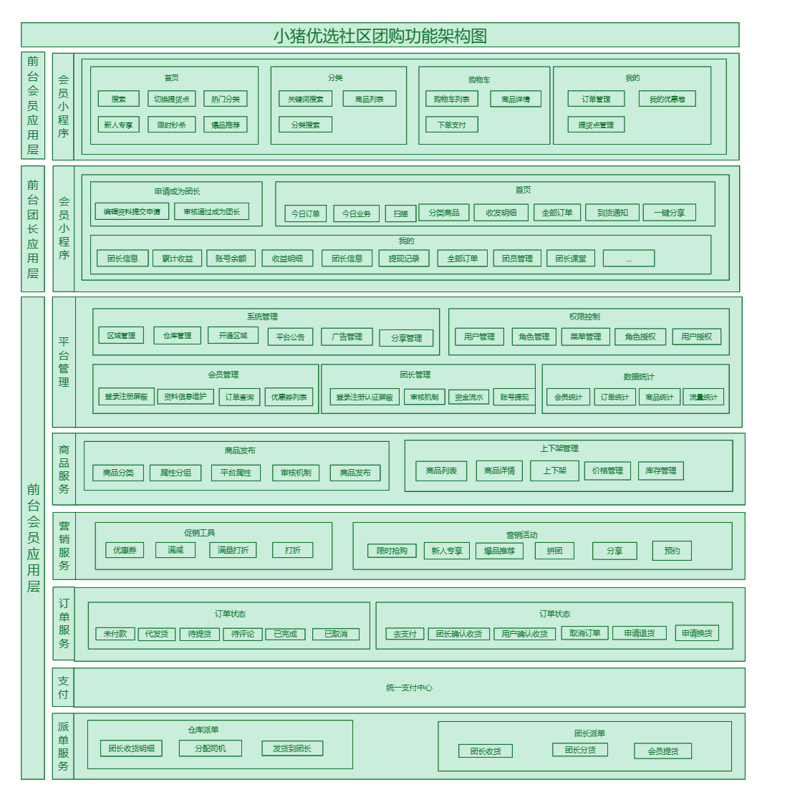
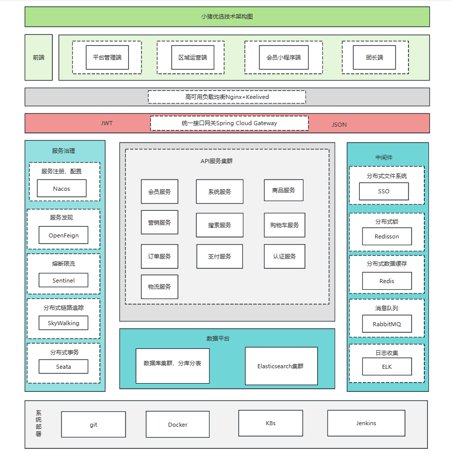
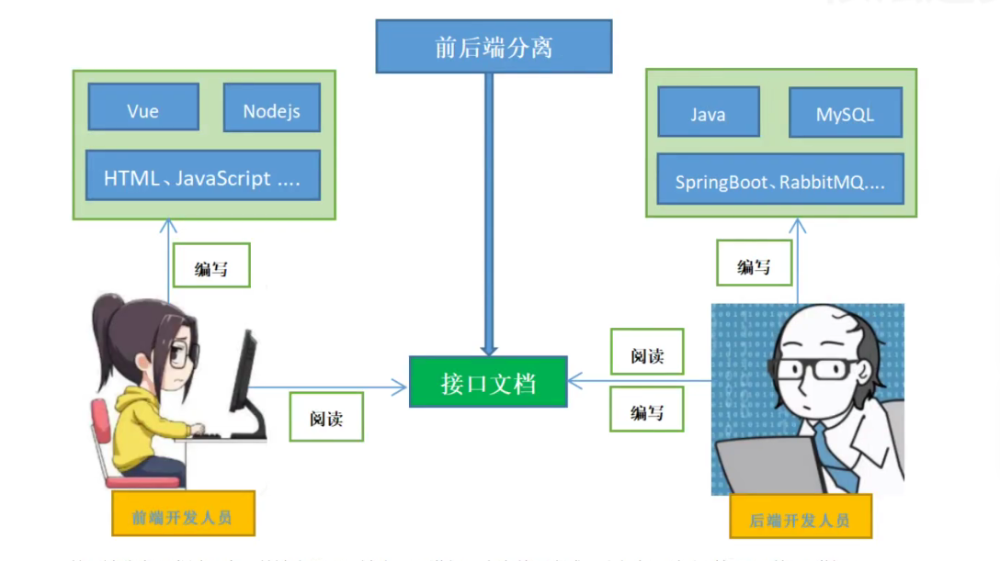

## 简介

类似于美团优选，多多买菜等线上平台。

是一套社区团购的项目，是依托真实社区的一种区域化、小众化、本地化、网络化的团购形式，同事也是一种生鲜商品流通的新零售模式。

背景：

社区团购是真实具名团体的一种互联网线上线下购物的消费行为，是依托真实社区的一种区域化、小众化、本地化、网络化的团购形式。简而言之。它是依托社区和团长社交关系实现生鲜上平流通的新型零售模式。

技术栈
项目采用前后端分离的开发方式，涵盖SpringBoot、SpringCloud、Redis、RabbitMQ、ElasticSearch、微信小程序等

业务流程梳理
从集体模式看，主要围绕平台、团长、用户三个角色展开

1、团长（如社区宝妈、便利店老板等）创建一个群，提前发布优惠商品的链接提供用购买，团长从中抽取佣金；

2、用户提前一天下单

3、平台在收集好订单之后，调动供应链，从仓库发货到自提点（团长家或者便利店）

4、用户前往自提点提货

## 功能架构

分为三层：

1、前台会员应用层

2、前台团长应用层

3、基础模块支撑层

## 技术架构

### 技术架构图

### 核心技术简介

#### SpringBoot

简化新`Spring`应用的初始搭建以及开发过程

#### SpringCloud

基于`Spring Boot` 实现的云原生应用开发工具

使用的技术：Spring Cloud Gateway、Spring Cloud OpenFeign、Spring Cloud Alibaba Nacos等

#### MyBatis-Plus

持久层框架

为什么不用MyBatis，plus更好

#### Redis

缓存数据库

包括购物车、库存信息，都在这个里面进行存储

#### Redisson

基于Redis的Java驻内存数据网格，实现分布锁

> `分布锁`:
>
> 在并发场景中或者多个服务中，同时做某个操作，会产生一些问题，这个方法就是用来解决这些问题的

#### RabbitMQ

消息中间件

> 下单完成之后，要扣库存，可以在这个过程中，通过RabbitMQ来做异步处理

#### ElasticSearch（ES） + Kibana

全文检索服务器 + 可视化数据监控

#### ThreadPoolExecutor

线程池来实现异步操作，提高效率

#### OSS

文件存储服务

#### Knife4j（Swagger）

API接口文档工具

是一个规范和完整的框架，用于生成、描述、调用和可视化RESTful风格的Web服务的接口文档

#### Nginx

负载均衡

#### MySQL

关系型数据库

#### 微信支付

#### 微信小程序

#### Docker

容器技术

#### DockerFile

管理Docker的镜像命令文本

#### 前后端分离开发

前后端分离开发，就是在我们项目的开发过程中，对于前端的代码由前端的开发人员开发，后端代码由后端人员负责开发。

这样的好处是，可以做到分工明确，各司其职，进而提高项目的开发效率。前后端代码并行开发，极大的加快了项目的开发进度。

目前前后端分离技术，被广大企业使用，已经成为了当前项目开发的主流开发方式。

前后端分离开发之后，工程结构也会发生变化，即：前后端代码不会混在一个maven工程中，而是分为前端工程和后端工程。

在互联网环境比较发达的国家，项目开发的分工协作更为明确。整个项目的开发分为前端、中间层和后端三个开发阶段。这三个开发阶段分别由三个或者更多的人来协作完成。国内大部分的互联网公司目前只有前端和后端开发工程师，中间层的工作是由前端或者后端来完成。

在这个过程中，前后端人员要配合一起来完成一个任务。

（1）、后端编写和维护接口文档、开发接口

（2）、前端根据接口文档进行开发

（3）、联调

接口（API接口）：是一个http的请求地址，主要定义：

1、请求路径

2、请求方式

3、请求参数

4、响应数据

...

## 后端环境搭建

## 开发日志

> 2023/12/04

- 在父工程里面锁定依赖版本
- common模块依赖

> 2023/12/03
- 核心技术简介
- 初始化创建后端模块

> 2023/12/02

- 系统架构调研和绘制
- 功能架构调研和绘制
> 2023/12/01
>
> -  调研项目背景和功能实现，
- 完成项目简介包括背景介绍
- 技术栈选择
- 业务流程梳理和绘制
- 功能和系统架构分析